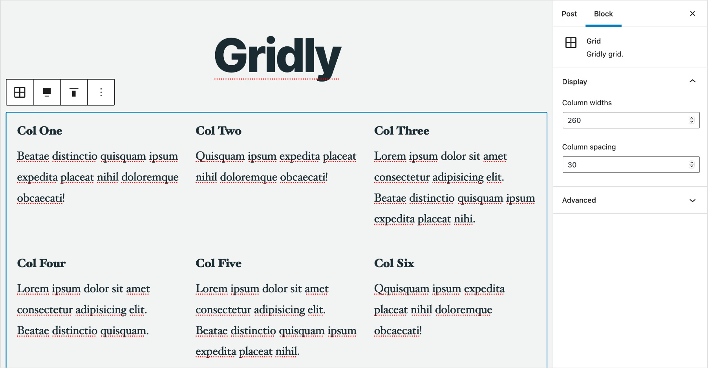

# Gridly

A bar bones responsive grid block for WordPress.

This plugin lets you add any number of columns to a responsive grid and loads no CSS on the frontend (it's just a few inline properties).
